## Создание слоя на карте

1. Открыть панель слоев на карте

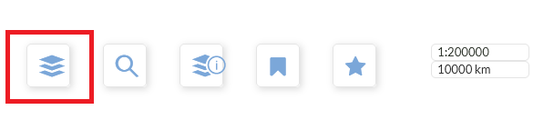

2. Создать слой tile (по кнопке "плюс")

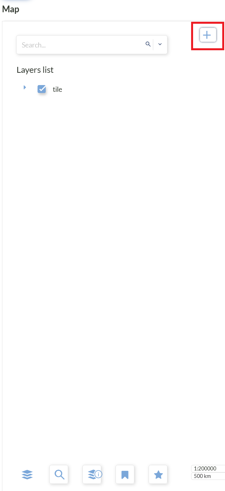

* Main settings:

    * Layer type = tile

  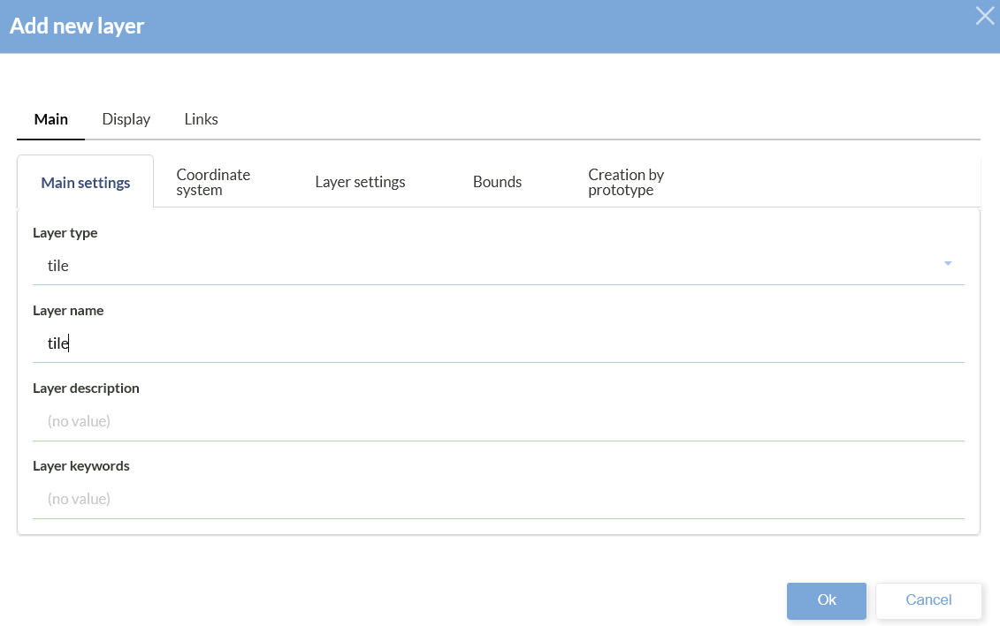
		
* Coordinate system:

	* Layer coordinate reference system (CRS) = EPSG:3857

  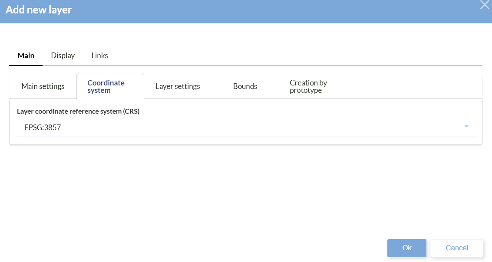
		
* Layer settings:

	* Url = http://{s}.tile.openstreetmap.org/{z}/{x}/{y}.png

  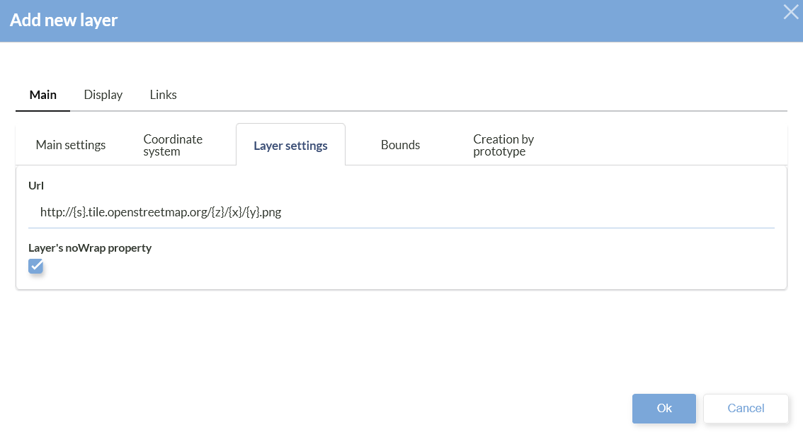
		
* Bounds:

	* Просто зайти, чтобы установились границы

  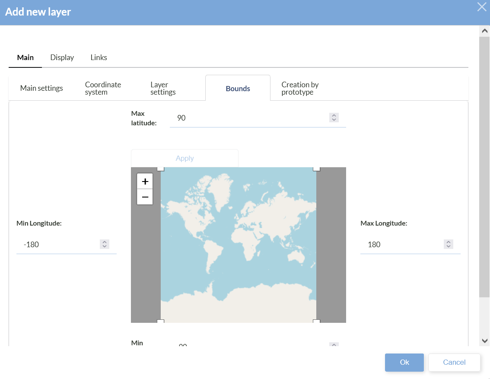
		
* Нажать ок
		
3. В Layers list поставить галочку у созданного слоя. Должна отразиться карта

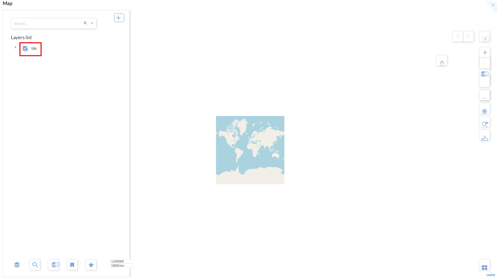

4. Приблизить карту примерно до России/Перми

6. Создать wms слой

* Открыть окно создания нового слоя (по кнопке "плюс")

 * Main settings:

     * Layer type = wms

    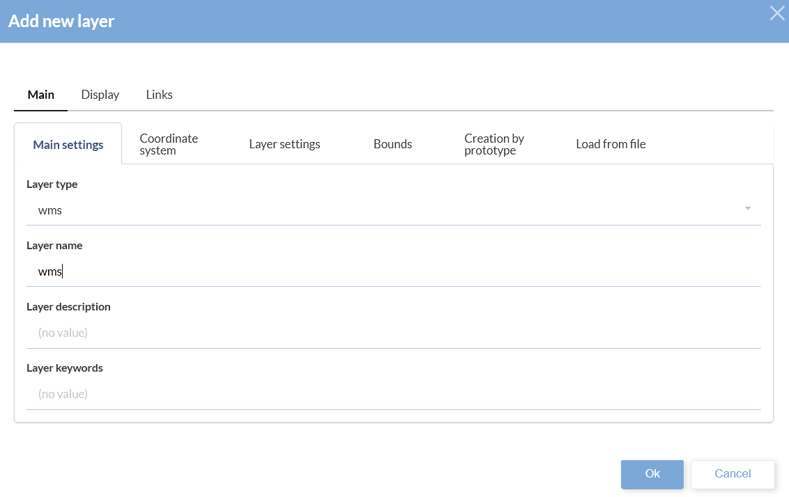
		
*  Coordinate system:

    * Layer coordinate reference system (CRS) = EPSG:4326

    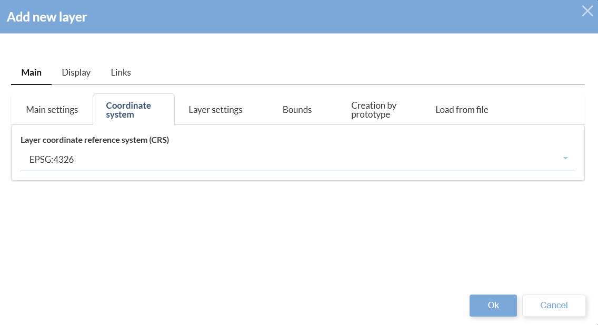
      
*  Layer settings:

    * GetFeatureInfo-responses format = application/json
    * Url = http://localhost:1819/geoserver/java-gis-odata-sample/wms
    * WMS version = 1.1.0
    * Layers = java-gis-odata-sample:water_line

    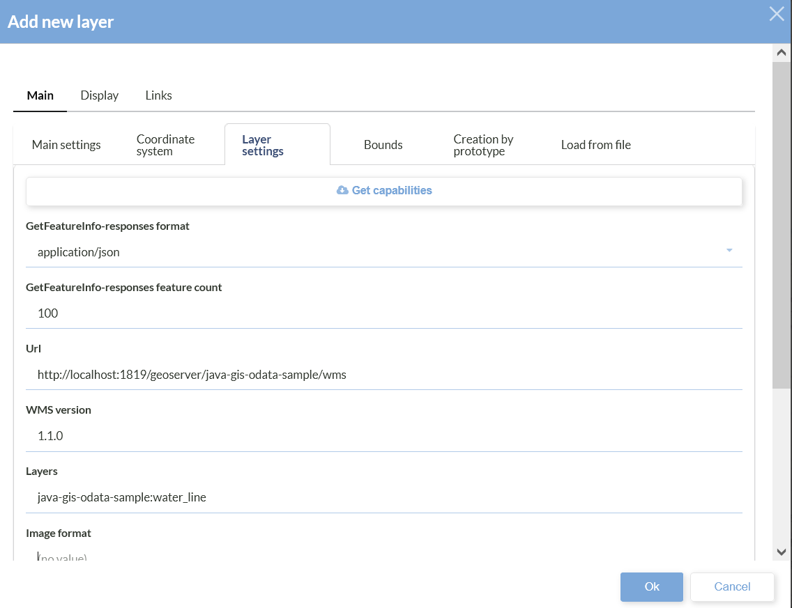
      
*  Bounds:

      * Просто зайти, чтобы установились границы
      
* Нажать ок
		
6. Раскрыть созданный слой и уменьшить его непрозрачность

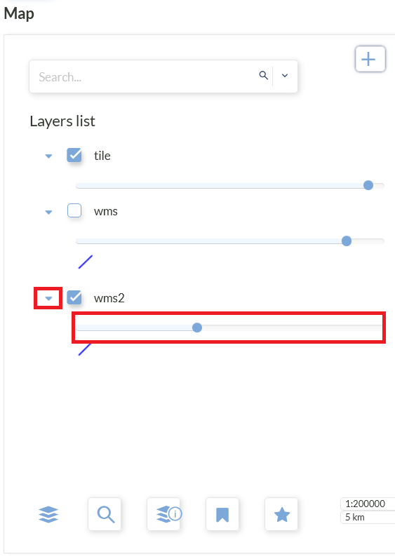

7. Карта выглядит так:

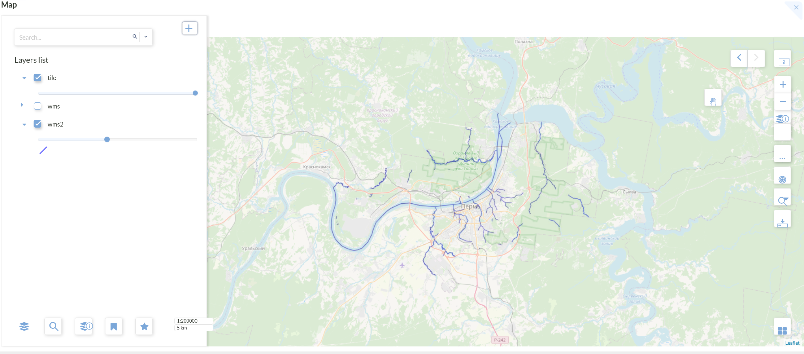
		
